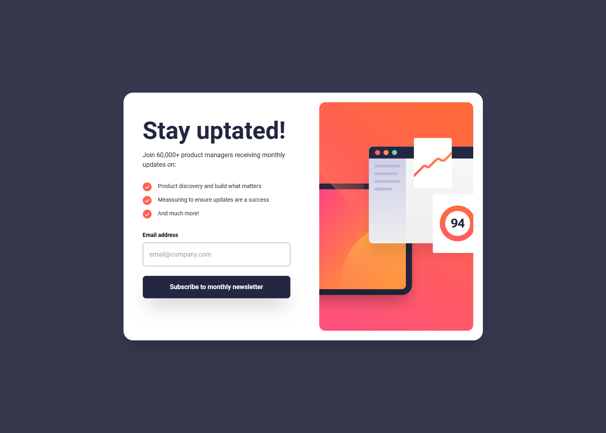

# Frontend Mentor - Newsletter sign-up form with success message solution

This is a solution to the [Newsletter sign-up form with success message challenge on Frontend Mentor](https://www.frontendmentor.io/challenges/newsletter-signup-form-with-success-message-3FC1AZbNrv). Frontend Mentor challenges help you improve your coding skills by building realistic projects. 

## Table of contents

- [Overview](#overview)
  - [The challenge](#the-challenge)
  - [Screenshot](#screenshot)
  - [Links](#links)
- [My process](#my-process)
  - [Built with](#built-with)
  - [What I learned](#what-i-learned)
  - [Useful resources](#useful-resources)
- [Author](#author)
- [Acknowledgments](#acknowledgments)

**Note: Delete this note and update the table of contents based on what sections you keep.**

## Overview

### The challenge

Users should be able to:

- Add their email and submit the form
- See a success message with their email after successfully submitting the form
- See form validation messages if:
  - The field is left empty
  - The email address is not formatted correctly
- View the optimal layout for the interface depending on their device's screen size
- See hover and focus states for all interactive elements on the page

### Screenshot




### Links

- Solution URL: [Github](https://github.com/andersondavid/newsletter-signup-form-with-success-message)
- Live Site URL: [Hosted on Github Pages](https://andersondavid.github.io/newsletter-signup-form-with-success-message/)

## My process

### Built with

- Semantic HTML5 markup
- Flexbox
- Mobile-first workflow
- [React](https://reactjs.org/) - JS library
- [Next.js](https://nextjs.org/) - React framework
- [Tailwindcss](https://tailwindcss.com/) - For styles


### What I learned


I had to relearn how to use the router in Next 13 with the directory `/app` because I was used to the old method. Since I chose to send the email through the query from one page to another, I needed to study about `useRouter` from `next/navigation`. For this purpose, I used the `.push` function and thus sent the email string to the other page. Here's an example of how to send the string.

```js
router.push("/success?email=" + email);
```
On the other page, I receive this string using `useSearchParams()`:

```js
const searchParams = useSearchParams();
const email = searchParams.get("email");
```


### Useful resources

- [Routing](https://nextjs.org/docs/pages/building-your-application/routing) - The Pages Router has a file-system based router built on concepts of pages.

## Author

- Website - [My website](https://andersondavid.vercel.app/)
- Frontend Mentor - [@andersondavid](https://www.frontendmentor.io/profile/andersondavid)
- Github - [@andersondavid](https://github.com/andersondavid)